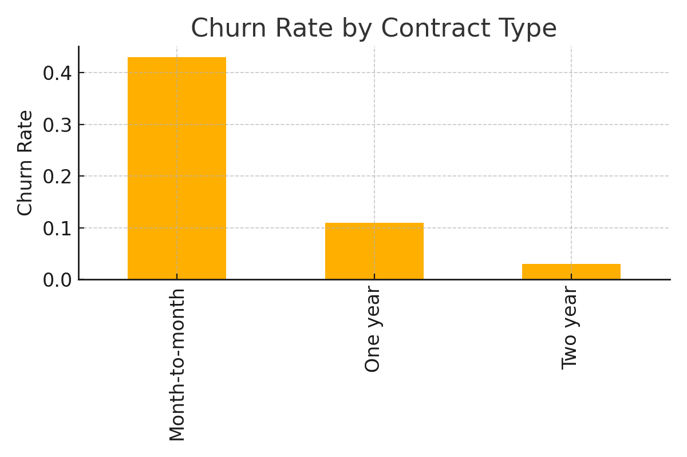

# Customer Churn Analysis - Exploratory Data Analysis (EDA)

This project performs exploratory data analysis (EDA) on a telecom-style customer churn dataset. The goal is to identify trends and patterns in customer behavior that lead to churn.

## 🔍 Key Insights

- Month-to-month contract customers have the highest churn rate.
- Longer-term contracts (1 or 2 years) significantly reduce churn.
- High monthly charges and short tenure are common churn indicators.

## 🧰 Tools Used

- Python
- Pandas
- Matplotlib
- Seaborn

## 📊 Visual Example

---

> This project is part of my Data Analyst Portfolio. Created with guidance and support from ChatGPT.
